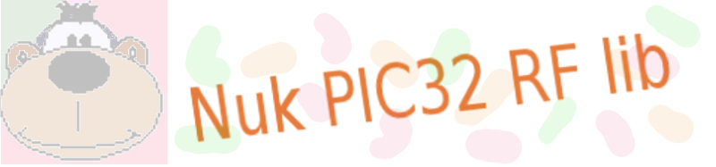

------------------------------------------------------------------------------


------------------------------------------------------------------------------
### **`Clase Rf`**


------------------------------------------------------------------------------

### Descripción


------------------------------------------------------------------------------

[Top](#TOP) | [Index](Index.md)

Los objetos de las clases **Rf** gestionan las entradas/salidas mediante el 
dispositivo de radiofrecuencia **nRF24L01+** o **nRF24L01** de **NORDIC**. 
   
Se operan con:
 
* **Constructores**
	* [**Rf** (
		char *channel*,
		const char\* *rxdir*,
		const char\* *txdir*,
		int *payload_len*,
		Spi_mstr *spi*,
		Digital *ce*,
		Digital *csn*,
		Digital *irqrf* )](#C01)

* **Métodos**
	* **Tx**
		* [bool **put**(const char\* *cadena*)](#M01)
		* [bool **put**(char\* *cadena*, unsigned int *size*)](#M02)
		* [bool **put_char**(char *byte*)](#M03)
		* [bool **put_line**(const char\* *cadena*)](#M04)
		* [bool **put_var**(const char\* *template*, void/* *var*, ...)](#M05)
	* **Rx**
		* [int **get**(char* *cadena*)](#G01)
		* [bool **get**(char* *cadena* ,int *size*)](#G02)
		* [char **get_char**()](#G03)
		* [bool **get_line**(char* *cadena*)](#G04)


------------------------------------------------------------------------------

### Constructores


------------------------------------------------------------------------------
<A name="C01"></A>

[Top](#TOP) | [Index](Index.md)

```C
Rf (
	char channel, 
	const char* rxdir, 
	const char* txdir, 
	int payload_len, 
	Spi_mstr spi, 
	Digital ce, 
	Digital csn, 
	Digital irqrf )
```

**Descripción**
>Prepara al dispositivo periférico RF para operar.
 
**Parámetros**
>char *chanel*
>>Canal de radio RF en el rango (0..196). El periférico funcionará a 
2.400 + *chanel* MHz.

> 
>const char* *rxdir*
>> Direción Rx.

> 
>const char* *txdir*
>> Direción Tx. Dispositivo al que envía los mensajes.

> 
>int *paylod_len*
>> Tamaño del paquete en el rango de (1..30). Este número no limita los bytes 
que se pueden transmitir en cada llamada a los comandos *put*. Aunque es 
preferible ajustarlo a su máximo más frecuente. Por ejemplo: Si sabemos que la 
información a enviar en la mayoría de las trasmisiones, no supera los 5 bytes, 
no tiene sentido que definamos este parámetro con un valor de 30; lo más 
eficiente será que establezcamos un valor de 5. Esto no impide hacer 
transmisiones de más bytes. El máximo número que se puede transmitir es el 
fijado en la macro BUFF_SIZE establecida en la librería *essentials*.

> 
>Spi_mstr spi
>> Objeto de la clase Spi_mstr a través del cual el microcontrolador gestionará 
al dispositivo RF.

>Digital ce, 
> 
>Digital csn, 
> 
>Digital irqrf
>>Puertos digitales con los que el módulo gestionará el dispositivo RF.
 
**Retorno**
>void
 
**Ejemplo**
> El siguiente fragmento de código prepara un objeto de la clase Rf.

```C
Spi_mstr spi(SPI2,7000000);
Digital rf_ce(DB10);
Digital rf_csn(DB14);
Digital rf_irq(DB06);
Rf radio(100,"1234A","1234B",30,spi,rf_ce,rf_csn,rf_irq);
```


------------------------------------------------------------------------------

### Métodos Tx


------------------------------------------------------------------------------
<A name="M01"></A>

[Top](#TOP) | [Index](Index.md)

```C
bool put(const char* cadena)
```

**Descripción**
>Transmite la cadena terminada en *NULL* pasada en el parámetro.
 
**Parámetros**
>const char* *cadena*
>> Cadena de bytes terminada en *NULL*.
 
**Retorno**
>bool
>> true == La trasmisión se ha realizado con éxito. 
>>
>> false == La transmisión ha fallado. En este caso es posible que el receptor 
haya recibido parte del mensaje.


**Ejemplo 1**
>El siguiente código prepara un objeto asociado a un dispositivo RF.
En cada iteración de *loop()* transmite el mensaje *¡¡¡ Hola mundo !!!*
 
```C
//----------------------------------------------
#include "Config_40.h"
#include "Nuk_pic32_essentials.h"
#include "Nuk_pic32_rf.h"

//----------------------------------------------
Spi_mstr spi(SPI2,7000000);
Digital rf_ce(DB10);
Digital rf_csn(DB14);
Digital rf_irq(DB06);
Rf radio(100,"1234A","1234B",30,spi,rf_ce,rf_csn,rf_irq);

//----------------------------------------------
void
loop(void) {

	radio.put(" ¡¡¡ Hola mundo !!! ");

	//...
	//...

	return;
	}

//----------------------------------------------
int
main(int argc, char** argv) {

	while(true) loop();

	return 0;
	}

```
 


------------------------------------------------------------------------------
<A name="M02"></A>

[Top](#TOP) | [Index](Index.md)

```C
bool put(char* cadena,unsigned int size)
```

**Descripción**
>Transmite el número de byte especificado en *size* de la *cadena*.
 
**Parámetros**
>const char* *cadena*
>> Cadena de bytes.
> 
>unsigned int *size*
>> Número de bytes a transmitir
 
**Retorno**
>bool
>> true == La trasmisión se ha realizado con éxito.
>>
>> false == La transmisión ha fallado. En este caso es posible que el receptor 
haya recibido parte del mensaje.


**Ejemplo 1**
>El siguiente código prepara un objeto asociado a un dispositivo RF.
En cada iteración de *loop()* transmite el mesaje *¡¡¡ Hola !!!*

```C
//----------------------------------------------
#include "Config_40.h"
#include "Nuk_pic32_essentials.h"
#include "Nuk_pic32_rf.h"

//----------------------------------------------
Spi_mstr spi(SPI2,7000000);
Digital rf_ce(DB10);
Digital rf_csn(DB14);
Digital rf_irq(DB06);
Rf radio(100,"1234A","1234B",30,spi,rf_ce,rf_csn,rf_irq);

//----------------------------------------------
void
Loop(void) {

	radio.put(" ¡¡¡ Hola mundo !!! ",9);
	radio.put((char*)(" ¡¡¡ Hola mundo !!! ")+15,5);

	//...
	//...

	return;
	}


//----------------------------------------------
int
main(int argc, char** argv) {

	while(true) loop();

	return 0;
	}

```


------------------------------------------------------------------------------
<A name="M03"></A>

[Top](#TOP) | [Index](Index.md)

```C
void put_char(char byte)
```

**Descripción**
>Transmite el *byte* especificado.

**Parámetros**
>const char *byte*
>> *byte* a transmitir.

**Retorno**
>void


------------------------------------------------------------------------------
<A name="M04"></A>

[Top](#TOP) | [Index](Index.md)

```C
bool put_line(const char* cadena)
```

**Descripción**
>Transmite la cadena terminada en cero pasada en el parámetro, y añade a la 
transmisión un byte de fin de linea (EOL).

**Parámetros**
>const char* *cadena*
>> Cadena de byte terminada en 0 (cero).

**Retorno**
>bool
>> true == La trasmisión se ha realizado con éxito. 
>>
>> false == La transmisión ha fallado. En este caso es posible que el receptor 
haya recibido parte del mensaje.


------------------------------------------------------------------------------
<A name="M05"></A>

[Top](#TOP) | [Index](Index.md)

```C
bool put_var(const char* template, void* var, ...])
```
**Descripción**
>Transmite La cadena de variables en número y tipo conforme a lo establecido en 
el patrón *template*

**Parámetros**
>const char* *template*
>>Cadena de bytes que define el número y tipos de los parámetros variables. 
>>Puede contener una cadena con los caracteres:
>>* 'c' ____ char
>>* 's' ____ cadena
>>* 'e' ____ cadena (incluirá un EOL)
>>* 'i' ____ integer
>>* 'l' ____ long
>>* 'd' ____ double

> 
>void* var, ...
>> Punteros a cada una de las variables a transmitir.

**Retorno**
>bool
>> true == La trasmisión se ha realizado con éxito. 
>>
>> false == La transmisión ha fallado. En este caso es posible que el receptor 
haya recibido parte del mensaje.


**Ejemplo**
>El siguiente código prepara un objeto asociado a un dispositivo RF.
En cada iteración de *loop()* se transmite el contenido de las variables.

```C
//----------------------------------------------
#include "Config_40.h"
#include "Nuk_pic32_essentials.h"
#include "Nuk_pic32_rf.h"

//----------------------------------------------
Spi_mstr spi(SPI2,7000000);
Digital rf_ce(DB10);
Digital rf_csn(DB14);
Digital rf_irq(DB06);
Rf radio(100,"1234A","1234B",30,spi,rf_ce,rf_csn,rf_irq);

//----------------------------------------------
void
Loop(void) {

	char C;
	static int I = 0;
	double D;
	char S[25];

	strcpy(S,"¡¡¡ Hola mundo !!!");
	I++;

	radio.put_var("cids",&C,&I,&D,S);

	//...
	//...

	return;
	}


//----------------------------------------------
int
main(int argc, char** argv) {

	while(true) loop();

	return 0;
	}

```


------------------------------------------------------------------------------

### Métodos Rx


------------------------------------------------------------------------------
<A name="G01"></A>

[Top](#TOP) | [Index](Index.md)

```C
int get(const char* cadena)
```

**Descripción**
>Lee de todos los bytes pendientes.

**Parámetros**
>const char* *cadena*
>> *Cadena* donde se depositarán los bytes leídos, más un byte *NULL*.

**Retorno**
>int size
>> Cantidad de bytes leídos de la **Fifo**.

**Nota**
>Es responsabilidad del programador que la *cadena* disponga del tamaño 
suficiente para albergar los bytes recibidos. 

**Ejemplo**
>El siguiente código prepara un objeto asociado a un dispositivo RF. 
En cada iteración de *loop*()se leen los bytes recibidos por el dispositivo.

```C
//----------------------------------------------
#include "Config_40.h"
#include "Nuk_pic32_essentials.h"
#include "Nuk_pic32_rf.h"

//----------------------------------------------
Spi_mstr spi(SPI2,7000000);
Digital rf_ce(DB10);
Digital rf_csn(DB14);
Digital rf_irq(DB06);
Rf radio(100,"1234A","1234B",30,spi,rf_ce,rf_csn,rf_irq);

//----------------------------------------------
void
loop(void) {

	char* entrada[BUFF_SIZE];
	int leidos;

	if( (leidos = radio.get(entrada)) ){
			{
			//...
			//...
			}

	//...
	//...

	return;
	}

//----------------------------------------------
int
main(int argc, char** argv) {

	while(true) loop();

	return 0;
	}

```


------------------------------------------------------------------------------
<A name="G02"></A>

[Top](#TOP) | [Index](Index.md)

```C
bool get(const char* cadena, int size)
```

**Descripción**
>Si se han recibido, lee tantos bytes como los especificados en *size*.

**Parámetros**
>const char* *cadena*
>> Puntero a la *cadena* que deberá tener, como mínimo, *size* bytes de espacio.

> int *size*
>> Cantidad de bytes a extraer.

**Retorno**
>bool
>> **true** Habían suficientes bytes. La cadena ha sido completada.
>>
>> **false** No hay suficientes bytes. El contenido de la cadena es invalido.

**Ejemplo**
>El siguiente código prepara un objeto asociado a un dispositivo RF. 
En cada iteración de *loop*() se leen tres bytes recibidos por el dispositivo.

```C
//----------------------------------------------
#include "Config_40.h"
#include "Nuk_pic32_essentials.h"
#include "Nuk_pic32_rf.h"

//----------------------------------------------
Spi_mstr spi(SPI2,7000000);
Digital rf_ce(DB10);
Digital rf_csn(DB14);
Digital rf_irq(DB06);
Rf radio(100,"1234A","1234B",30,spi,rf_ce,rf_csn,rf_irq);

//----------------------------------------------
void
poop(void) {

	char* entrada[4];

	// Leemos tres bytes, si los hay
	if( radio.get(entrada,3) ){
			{
			//...
			//...
			}

	//...
	//...

	return;
	}

//----------------------------------------------
int
main(int argc, char** argv) {

	while(true) loop();

	return 0;
	}

```


-------------------------------------------------------------------------------
<A name="G03"></A>

[Top](#TOP) | [Index](Index.md)

```C
char get_char()
```

**Descripción**
>Si se ha recibido, lee un byte.

**Parámetros**
>void

**Retorno**
>char
>> Si lo hay, el byte leido.
>> Si no lo hay 0 (cero).

**Ejemplo**
>El siguiente código prepara un objeto asociado a un dispositivo RF. 
En cada iteración de *loop*() se lee un byte recibido por el dispositivo.

```C
//----------------------------------------------
#include "Config_40.h"
#include "Nuk_pic32_essentials.h"
#include "Nuk_pic32_rf.h"

//----------------------------------------------
Spi_mstr spi(SPI2,7000000);
Digital rf_ce(DB10);
Digital rf_csn(DB14);
Digital rf_irq(DB06);
Rf radio(100,"1234A","1234B",30,spi,rf_ce,rf_csn,rf_irq);

//----------------------------------------------
void
loop(void) {

	char entrada;

	// Esperamos a recibir 1 byte
	while( !(entrada = radio.get_char()) );

	//...
	//...

	return;
	}

//----------------------------------------------
int
main(int argc, char** argv) {

	while(true) loop();

	return 0;
	}
```


------------------------------------------------------------------------------
<A name="G04"></A>

[Top](#TOP) | [Index](Index.md)

```C
bool get_line(char* cadena)
```

**Descripción**
>Lee los bytes pendientes hasta encontrar un final de linea (*EOL*). 
Si entre los bytes recibidos no aparece *EOL*, la función devuelve
**false** y el contenido de la *cadena* será invalido.

**Parámetros**
>char* cadena
>>Cadena receptora de los bytes. En la cadena, *EOL* será sustituido por 
*NULL*.

**Retorno**
>bool
>> **true** si se ha leído algún byte.
>>
>> **false** en caso contrario.

**Nota**
> Observa que, aun cuando pudieran haber bytes pendientes, 
estos no serán devueltos por el método si no se ha encontrado un *EOL*.

**Ejemplo**
>El siguiente código prepara un objeto asociado a un dispositivo RF. 
En cada iteración se lee una línea recibida por el dispositivo.

```C
//----------------------------------------------
#include "Config_40.h"
#include "Nuk_pic32_essentials.h"
#include "Nuk_pic32_rf.h"


//----------------------------------------------
Spi_mstr spi(SPI2,7000000);
Digital rf_ce(DB10);
Digital rf_csn(DB14);
Digital rf_irq(DB06);
Rf radio(100,"1234A","1234B",30,spi,rf_ce,rf_csn,rf_irq);


//----------------------------------------------
void
loop(void) {

	char* entrada[BUFF_SIZE];

	while( !radio.get_line(entrada) );

	//...
	//...

	return;
	}

//----------------------------------------------
int
main(int argc, char** argv) {

	while(true) loop();

	return 0;
	}

```


[Top](#TOP) | [Index](Index.md)

